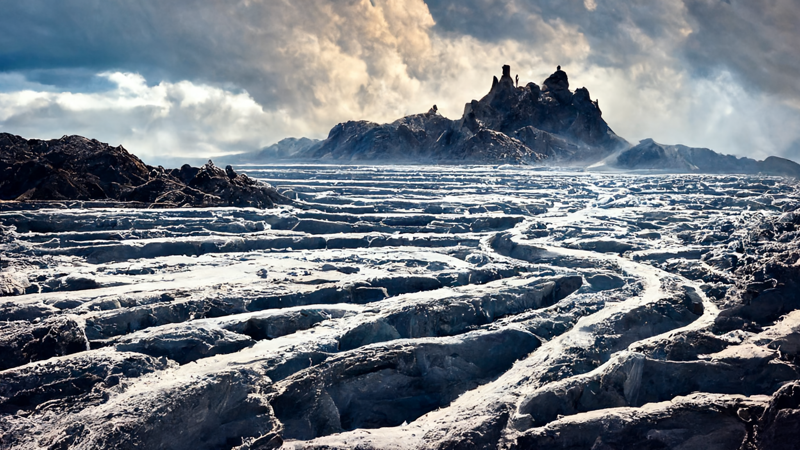

# Planet Akínitos

The planet [*Akínitos*](./glossary.md#akínitos) is almost entirely covered by ice, however thanks to what appears to be a geothermal anomaly, a relatively small area stays above the freezing point for almost the entire year, the [*Summer Sea*](./glossary.md#summer-sea). This valley of warmth is surrounded by an [*ice wall*](./glossary.md#ice-wall) almost a mile high. During summer, huge clumps of ice break away and fall onto the lands below, supplying them with fresh water just to be reformed during the unforgiving blizzards of the winter months.

---

## The Heliod System
[*Akínitos*](./glossary.md#akínitos) is fourth of the nine planets that are being circled by [*Heliod*](./glossary.md#heliod). 

While all people of knowledge agree that there planets are much closer to [*Akínitos*](./glossary.md#akínitos) than the stars that decorate the heavens, it has not yet been possible to build a bridge to any of them, or to at least hit one with an arrow.

Ever since the [*Rain of Fire and Death*](./glossary.md#days-of-rain-of-fire-and-death) mishap, where one such highly aimed arrow must have hit Heliod in his eye, the [*Heavens Protection Law*](./glossary.md#heavens-protection-law) has been adopted throughout all of the civilized lands. It states that any structures or objects capable of reaching the heavens must be pre-approved by high priests all all the Gods of the [*pantheon*](./glossary.md#pantheon) and may only be constructed (or launched) when it has been made sure that no Gods are present in the trajectory.

---

## The Moon

Believed to be the home of [*Athreos*](./glossary.md#athreos), the God of Passage, [*Akínitos's*](./glossary.md#akínitos) tidally locked moon orbits once every 31 days. According to the followers of [*Athreos*](./glossary.md#athreos), all souls of all mortal beings travel to the moon after their bodies have perished. Upon arrival, the [*God of Passage*](glossary.md#athreos) ensures that they either reach the realm of the god they worshipped most during their live or forever roam the far side of the moon if they worshipped none.

---

## The Sea of Endless Ice

The [*Sea of Endless Ice*](./glossary.md#sea-of-endless-ice) covers almost the entire surface of the planet. Strong cold winds and blizzards picking up sharp little ice crystals from the surface make exploration very difficult. Traveling across this freezing desert is only possible with strong magical shields and equipment.

Even though a good number of expeditions has been undertaken, none have yielded any valuable discoveries so far and many never returned. Nevertheless the people of the [*Summer Sea*](./glossary.md#summer-sea) have not yet given up hope and continue to embark on these deadly expeditions beyond the [*Ice Wall*](./glossary.md#ice-wall).

---

## The Geothermal Anomaly

It has been confidently observed that the heat that allows the [*Summer Sea*](./glossary.md#summer-sea) to be habitable comes from the depths below, however, noone has been able to explain why or if only this part of the planet is being heated in such a manner.

Some say it's a favor of the [*Gods*](./glossary.md#pantheon), but then why would they heat only a fraction of the planet? Others believe the answer lies behind the [*Gate to Oblivion*](./glossary.md#gate-to-oblivion) though only a few of those who ventured in have returned, and those who did appear to have forgotten what they saw.

---
## Further Reading
This has been an article about [*Akínitos*](./glossary.md#akínitos). For further reading please check out the [*Encyclopedia*](./index.md).