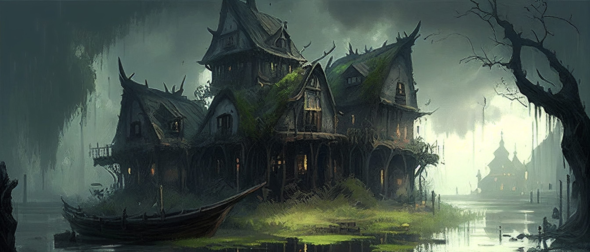

# Town of Brekéke

In the midst of the Marshes of Malária, among the ruins of a long lost polis lays the town of [*Brekéke*](./glossary.md#brekéke). The once prosperous trading hub is now home to pirates and shady individuals.

There is not much left to visit in [*Brekéke*](./glossary.md#brekéke) for [*Nylea*](./glossary.md#nylea) is reclaiming the land back to her realm, however there are the ruins of a [*temple*](#temple-of-nylea), a [*general store*](#iphicrates-floating-store) and the infamous [*Frogleg Tavern*](#frogleg-tavern).

---

## History and Lore

[*Brekéke*](./glossary.md#brekéke) was once a bustling port town situated on the edge of the [*Marshes of Malária*](./glossary.md#marshes-of-malária), a vast and treacherous wetland that stretches for miles in all directions. In its heyday, it was known throughout the [*Summer Sea*](./glossary.md#summer-sea) as a hub of commerce and culture, where merchants from distant lands would come to trade exotic goods and share stories of their travels.

The town was founded by a group of wealthy aristocrats from nearby [*Maxipolis*](./glossary.md#maxipolis), who saw the potential for profit in the rich resources of the swamp. They hired skilled laborers to build docks and warehouses along the riverbank, and soon [*Brekéke*](./glossary.md#brekéke) was filled with bustling markets, luxurious villas, and ornate temples to the [*Gods*](./glossary.md#pantheon).

For many years, the people of [*Brekéke*](./glossary.md#brekéke) enjoyed a life of wealth and leisure. They hosted lavish parties and festivals, where guests would feast on delicacies from all over the world and dance to the music of skilled musicians and performers. The town was also known for its exceptional art and literature, with many renowned artists and poets calling [*Brekéke*](./glossary.md#brekéke) home.

However, this golden age was not to last. One day, [*a mysterious illness*](./glossary.md#curse-of-the-swamp) swept through the town, killing many of its citizens and leaving the survivors weakened and vulnerable. The once-prosperous port fell into disrepair as its trade routes were abandoned, and the wealthy merchants who once called [*Brekéke*](./glossary.md#brekéke) home fled to safer lands.

As the years passed, [*Brekéke*](./glossary.md#brekéke) became a ghost town, with its crumbling buildings and deserted streets haunted by the memories of a time long gone. The [*swamp*](./glossary.md#marshes-of-malária) reclaimed much of the land, and the only visitors to the town were scavengers, bandits and pirates who preyed on the remaining ruins.

Despite the town's fall from grace, some believe that there is still treasure to be found in its abandoned buildings and underground tunnels. Adventurers who brave the dangers of the swamp may find ancient artifacts or forgotten riches, but they must beware the spirits that still linger in the ruins of [*Brekéke*](./glossary.md#brekéke).

---

## Frogleg Tavern

Hidden among the ruins of the once-great port town, [*Frogleg Tavern*](./glossary.md#frogleg-tavern) takes its name from a local legend that tells of a band of pirates who made a pact with the [*Nylea*](./glossary.md#nylea) who gifted them with the ability to leap like frogs and evade capture in return of a promise, not to rebuild the city.

[*Frogleg Tavern*](./glossary.md#frogleg-tavern) is a rough-and-tumble establishment, with wooden tables and chairs, flickering torches on the walls, and a rowdy crowd of seafarers and scoundrels.

The tavern is run by a fearsome woman named [*Kallisto*](./glossary.md#kallisto), who is known throughout the [*Summer Sea*](./glossary.md#summer-sea) as a savvy and ruthless pirate queen. [*Kallisto*](./glossary.md#kallisto) has wild black hair a sharp tongue, and she rules the [*Frogleg Tavern*](./glossary.md#frogleg-tavern) with an iron fist.

Despite its rough reputation, the [*Frogleg Tavern*](./glossary.md#frogleg-tavern) is a popular meeting place for pirates and smugglers from all over the world. They come to drink, gamble, and swap stories of their adventures on the high seas. Some even come to seek the services of [*Kallisto*](./glossary.md#kallisto) and her crew, who are said to be the most skilled sailors and fighters in the swamps.

---

## Temple of Nylea

The temple in [*Brekéke*](./glossary.md#brekéke) was once a grand structure dedicated to the worship of the goddess [*Ephara*](./glossary.md#ephara), the patron deity of civilisation. It was a place of great reverence and learning, where scholars and philosophers from all over the [*Summer Sea*](./glossary.md#summer-sea) would come to study and debate.

After the fall of [*Brekéke*](./glossary.md#brekéke), the temple fell into disrepair, and the once-sacred halls were left to decay. It wasn't until the arrival of the pirates that the temple was given new life.

Led by [*Old Rootbeard*](./glossary.md#old-rootbeard), the pirates rededicated the temple to [*Nylea*](./glossary.md#nylea), as part of their pact with her. They transformed the temple into a place of natural beauty, and see themselves as the guardians of the natural world. The once-dusty halls are now filled with plants and flowers, and the air is thick with the scent of herbs and incense. They perform regular rituals and offerings to [*Nylea*](./glossary.md#nylea), fiercely defending the temple and the natural world it represents.

At the docks of [*Brekéke*](./glossary.md#brekéke) there is also a humble but busy shrine to [*Thassa*](./glossary.md#thassa), the godess of the sea and to [*Mogis*](./glossary.md#mogis), the god of slaughter.

---

## Iphicrates' Floating Store

The floating general store of [*Brekéke*](./glossary.md#brekéke) is built on a small boat that drifts lazily through the swamp. It is a modest structure, with a few wooden shelves and a counter, but it is well-stocked with all the necessities that a traveler might need ranging from dried meats and fruits to weapons and tools as well as maps and guidebooks, collected from visiting pirates.

The store belongs to a traveling merchant named [*Iphicrates*](./glossary.md#iphicrates), who is known throughout [*Malária*](./glossary.md#malária) as a shrewd and canny businessman. He speaks several languages fluently and has a knack for haggling, which has made him a favorite among the pirates and smugglers who frequent [*Brekéke*](./glossary.md#brekéke).

Despite his sharp tongue and reputation as a wheeler-dealer, [*Iphicrates*](./glossary.md#iphicrates) is also known for his generosity and hospitality. He is always ready to share a meal or a drink with a weary traveler, and has been known to offer his boat as a place to rest for the night.

---

Go back to [**Index**](./index.md) | [**Places**](./places.md) | [**Western Shores**](./westernshores.md)     