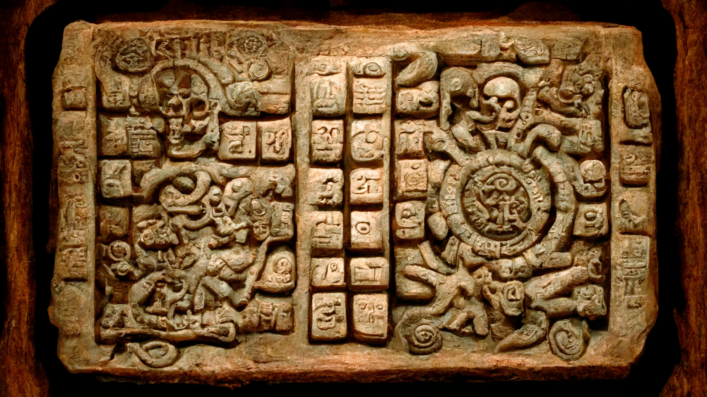
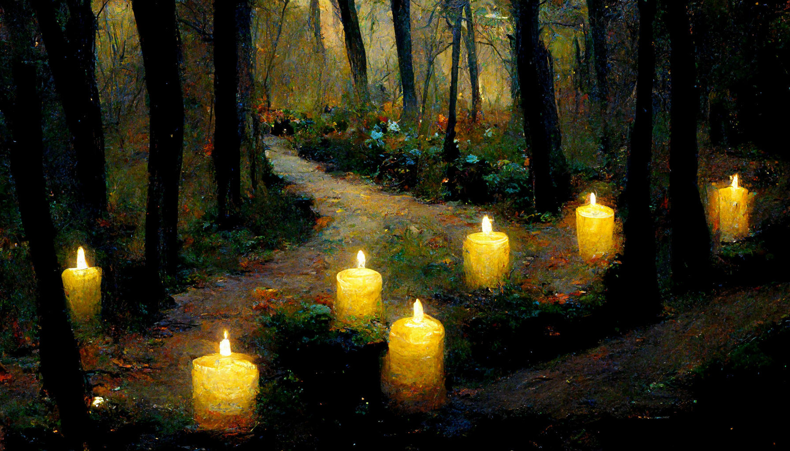
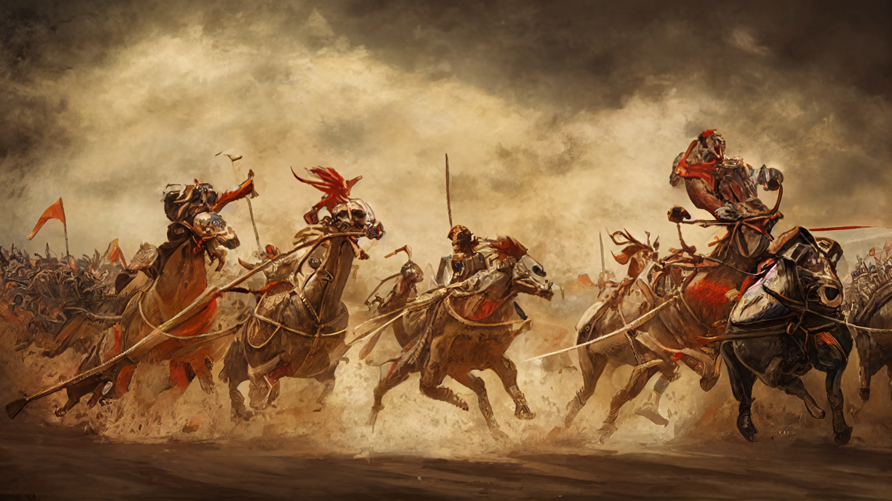
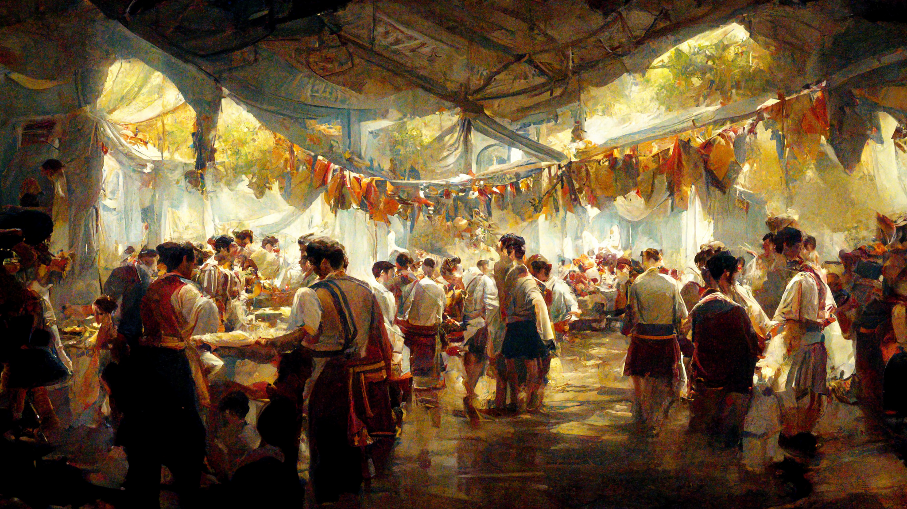
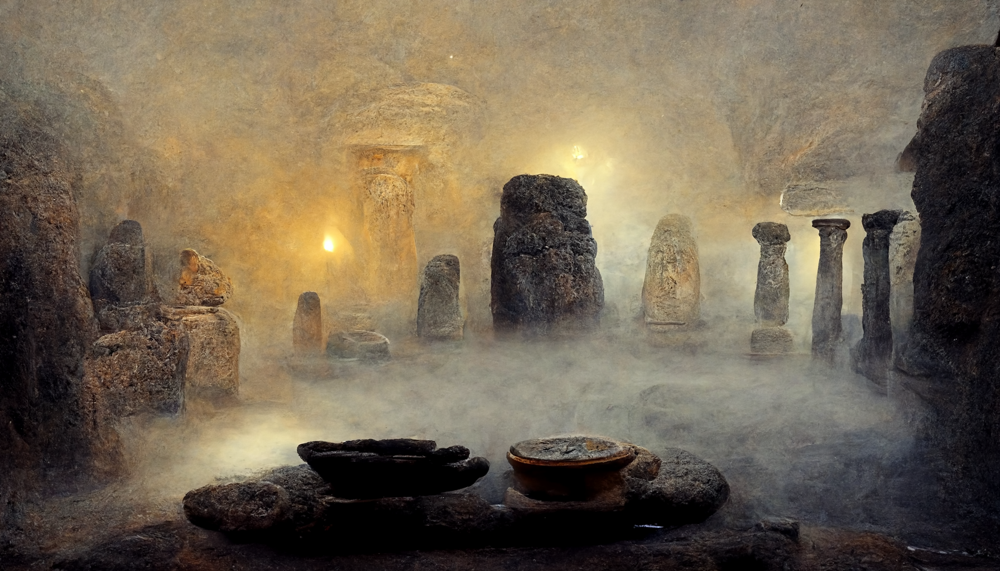

# Calendar

This is the [*Akínitionian*](./glossary.md#akínitos) Calendar. The year is split into 15 months each exactly four weeks or 20 days long. Days of the week are as follows: Protos, Duteros, Tritos, Tetaros, Pemptos. While all sentients in the [*Summer Sea*](./glossary.md#summer-sea) use the same divisions, they reference the dates differently - the more technical [*dwarves*](./glossary.md#dwarf) write their dates as Day.WW.YYYY (i.e. Tritos.56.1234) while the more nature oriented [*elves*](./glossary.md#elf) use Nth Day in Month of Year YYYY (i.e. 2nd Protos in the Moon of Ephara, 1234).

The months are named after the Gods of the Pantheon alphabetically as follows: Month of [*Athreos*](./glossary.md#athreos), [*Ephara*](./glossary.md#ephara), [*Erebos*](./glossary.md#erebos), [*Heliod*](./glossary.md#heliod), [*Iroas*](./glossary.md#iroas), [*Karametra*](./glossary.md#karametra), [*Keranos*](./glossary.md#keranos), [*Klothys*](./glossary.md#klothys), [*Kruphix*](./glossary.md#kruphix), [*Mogis*](./glossary.md#mogis), [*Nylea*](./glossary.md#nylea), [*Pharika*](./glossary.md#pharika), [*Phenax*](./glossary.md#phenax), [*Purphoros*](./glossary.md#purphoros) and [*Thassa*](./glossary.md#thassa). 

---

## Important Dates
There are many culturally important days throughout the [*Akínitonian year*](./glossary.md#akínitos). The most famous and widely celebrated ones are listed below.

### Festival of the Dead
**Pemptos, 20th day in the Month of [*Athreos*](./glossary.md#athreos)**

The [*Festival of the Dead*](./glossary.md#festival-of-the-dead) is commonly held on the last in the month of [*Athreos*](./glossary.md#athreos), the God of Passage. Communities all around the [*Summer Sea*](./glossary.md#summer-sea) say one last farewell to passed away friends and family members and pray to [*Athreos*](./glossary.md#athreos) so he will guide each mortals soul to the [*afterlife*](./glossary.md#nyx). This is usually done by lighting candles along paths outside, especially at temples of [*Athreos*](./glossary.md#athreos) and locations where someone has died recently. These candles then symbolically guide the [*God of Passage*](./glossary.md#athreos) towards the souls he is supposed to ferry into the [*Nyx*](./glossary.md#nyx). 

---

### Festival of the Sun
**Pemptos, 15th day in the Month of [*Heliod*](./glossary.md#heliod)**

The [*Festival of the Sun*](./glossary.md#festival-of-the-sun) celebrates the middle of Summer in the [*Summer Sea*](./glossary.md#summer-sea). On this day, [*Heliod*](./glossary.md#heliod) rises exactly into the middle of the sky and for a brief moment pushes all shadows away. To celebrate the [*Sun Gods*](./glossary.md#heliod) generosity, everyone paints their clothes and faces in the brightest colours they can get to let them shine throughout the day. Later, big feasts are prepared and the night is lit by magic lights and bonfires as the festivities go on until the next morning.

---

### Iroan Games
**Protos, 16th day in the Month of [*Iroas*](./glossary.md#iroas)**

Held in the last week in the month of [*Iroas*](./glossary.md#iroas), the [*Iroan Games*](./glossary.md#iroan-games) not only provide great entertainment for the citizens of the [*Summer Sea*](./glossary.md#summer-sea), but also allow any being who feels worthy to participate and prove their worth to the [*God of Victory*](./glossary.md#iroas) himself. While the events and competitions remain the same, the games are held in a different town each year and take an entire week to complete. During this period, many feasts and rituals of love take place to celebrate the victors and prepare them for the next day of trials.

---

### Zwachtenbecht Festival
**Pemptos, 20th day in the Month of [*Karametra*](./glossary.md#karametra)**

The [*Zwachtenbecht Festival of the Ancestors*](./glossary.md#zwachtenbecht) is celebrated across all of the [*Summer Sea*](./glossary.md#summer-sea). Interestingly no one can remember how [*Zwachtenbecht*](./glossary.md#zwachtenbecht) came to be or how it was originally performed and so everyone celebrates it their own way: the [*dwarves*](./glossary.md#dwarf) drink, the [*elves*](./glossary.md#elf) play their instruments while the [*humans*](./glossary.md#human) sing their songs, the [*nymphs*](./glossary.md#nymph) dance as if there was no tomorrow and the [*orcs*](./glossary.md#orc) brawl as they always do.

---

### Summers End
**Pemptos, 10th day in the Month of [*Klothys*](./glossary.md#klothys)**

As the name suggests, [*Summers End*](./glossary.md#summers-end) is held at the end of summer in the [*Summer Sea*](./glossary.md#summer-sea). People prepare rituals and say prayers to [*Klothys, the God of Destiny*](./glossary.md#klothys) seeking his wisdom and glympses of things to come, so they can better prepare for the coming winter. Contrary to other festivals, no feasts are being held during this time, as food supplies for the winter are made and any wasting is considered a bad omen from now on. 

---

### Nymphan Games
**Protos, 1st day in the Month of [*Nylea*](./glossary.md#nylea)**

Celebrated exclusively by the [*nymphs*](./glossary.md#nymph) of the [*Southern Shore*](./glossary.md#southern-shores) the [*Nymphan Games*](./glossary.md#nymphan-games) honour [*Nylea*](./glossary.md#nylea), the Godess of the Hunt. Similar to the [*Iroan Games*](./glossary.md#iroan-games) anyone is allowed to participate, however, since the hunters try to stay hidden and become one with the forest, these games are much less of a show than their counterpart. Furthermore, many are hesitant to join as loosing might lead to a life in servitude. 

When the games begin, a group of hunters enters the [*Sacred Hunting Grounds*](./glossary.md#nym) and then hunt each other until either the sun rises three times or there are no more participants left to be caught. Once caught, the victim is forever bound to serve the will of their hunter and may only be released through a [*special ritual*](./glossary.md#ritual-of-mercy). When the games are over, rythmic dances and trance-inducing music erupt throughout the [*Nym*](./glossary.md#nym), celebrating the new champion.

---

### Goldleaf Festival
**Pemptos, 20th day in the Month of [*Nylea*](./glossary.md#nylea)**

Far across the [*Summer Sea*](./glossary.md#summer-sea) the [*elves*](./glossary.md#elf) of the [*Silent Sea*](./glossary.md#silent-sea) also honour the [*Godess of the Hunt*](./glossary.md#nylea) though in a much more peaceful way. Once the leaves of the [*Elvenwood Tree*](./glossary.md#elvenwood-tree) turn golden and fall, the [*elves*](./glossary.md#elf) collect and build tiny boats with them. They associate each boat with their dearest achievement or trophy they collected this year and let them float on the [*silent sea*](./glossary.md#silent-sea), dedicating their victories to [*Nylea*](./glossary.md#nylea) and quietly thanking her for the power she has granted them. Other cultures have adopted this custom and show [*Nylea*](./glossary.md#nylea) their trophies in their own way: some tattoo symbols of their prey onto their skin, some write songs or poems for the [*Godess*](./glossary.md#nylea) and the [*orcs*](./glossary.md#orc) brawl, obviously.

---

### Winters End
**Pemptos, 20th day in the Month of [*Thassa*](./glossary.md#thassa)**

[*Winters End*](./glossary.md#winters-end) is a quiet festival, celebrating the end of the cold season. During this time, houses are cleaned, broken infrastructure repaired and tools prepaired for the upcoming warm season. Ceremonies are held to thank [*Thassa*](./glossary.md#thassa), the Godess of the Sea for replenishing the glaciers with fresh snow and calming the [*Summer Sea*](./glossary.md#summer-sea) so ships can cross safely once more.

---
## Further Reading
This has been an article about the [*Akínitonian Calendar*](./glossary.md#calendar). For further reading please check out the [*Encyclopedia*](./index.md).