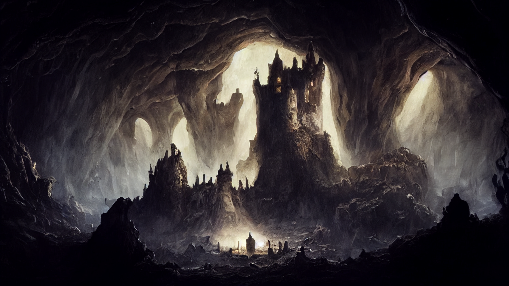
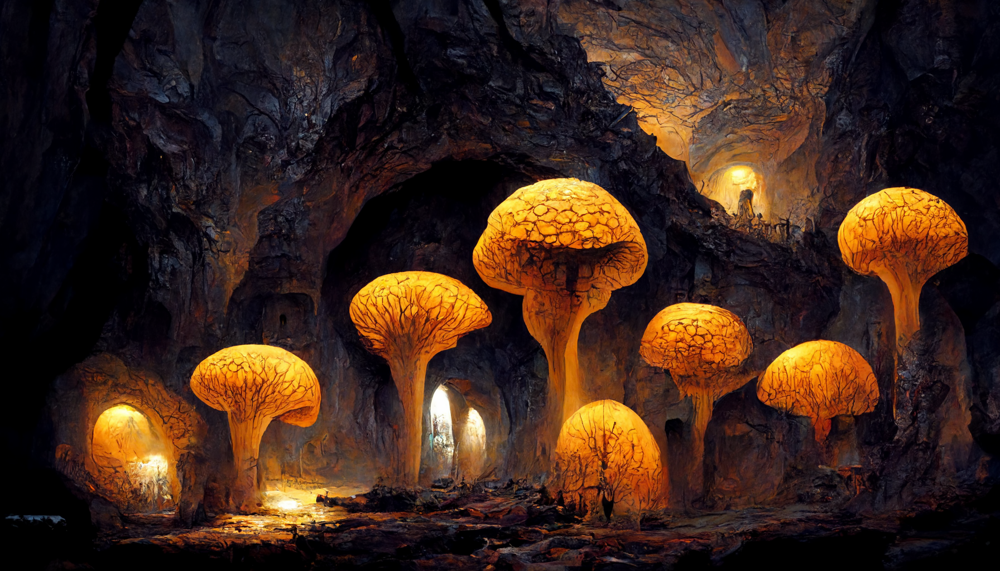

# Castle Queblekh

Located deep inside the [*caves*](./glossary.md#spiderweb-cave-system) underneath the [*Cyclops Mountains*](./glossary.md#cyclops-mountains), [*castle Queblekh*](./glossary.md#castle-queblekh) serves as the main stronghold for the [*Cult of Silence*](./glossary.md#cult-of-silence) and contains their most sacred source of power, the [*Tablet of the Ancient One*](./glossary.md#tablet-of-the-ancient-one).

To maintain the [*castle*](./glossary.md#castle-queblekh) secrecy and in order to protect it from intruders, the [*caves*](./glossary.md#spiderweb-cave-system) leading to the [*castle*](./glossary.md#castle-queblekh) have mostly been sealed, and a once-in-never-out rule has been established. Only high ranking [*cult*](./glossary.md#cult-of-silence) members may come and go as they please and only do so through magical portals. [*Mellisanthé*](./glossary.md#mellisanthé-the-cruel) herself visits the stronghold only rarely, either to give out new orders to the inner circle of the [*cult*](./glossary.md#cult-of-silence) or to communicate with her overlord, [*Prince Morbogh*](./glossary.md#prince-morbogh-of-eternal-doom). 

---

## History

Build by the [*dark elves*](./glossary.md#dark-elf) eons ago, this [*castle*](./glossary.md#castle-queblekh) and its mushroom fields once served as a thriving metropolis of the [*lost kingdom*](./glossary.md#lost-kingdom). Why the [*dark elves*](./glossary.md#dark-elf) deserted this place is still unclear, however it provided the perfect hideout for the [*Cult of Silence*](./glossary.md#cult-of-silence) to settle in to. While the sealing of the surrounding [*caves*](./glossary.md#spiderweb-cave-system) provided much needed secrecy, it also greatly reduced available space for mushroom farming and thus greatly limiting the size of the [*castle*](./glossary.md#castle-queblekh) garrison.

Little is known about the [*castle*](./glossary.md#castle-queblekh) former owners, as most of [*dark elven*](./glossary.md#dark-elf) history was lost with their [*kingdom*](./glossary.md#lost-kingdom).
Some sources however indicate, that it once hosted the court of [*Dark Lady Dorothéa*](./glossary.md#dark-lady-dorothéa).

---

## Location and Floorplan

As pretty much all entrances to the [*castle*](./glossary.md#castle-queblekh) have been sealed, the only way in and out is through a magical portal that has been cast by someone who has already been there.

---
## Further Reading
This has been an article about [*Castle Queblekh*](./glossary.md#castle-queblekh). For further reading please check out the [*Encyclopedia*](./index.md).