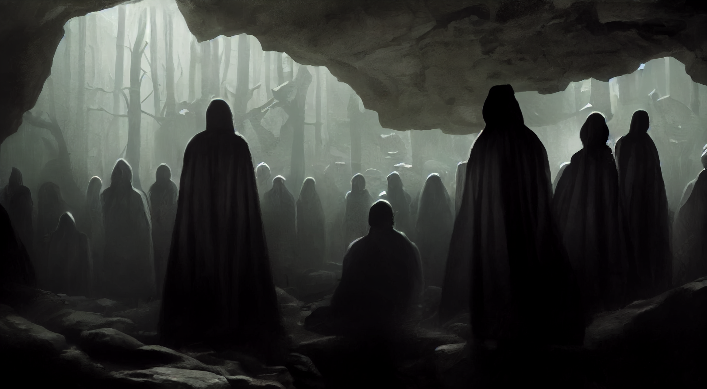

# The Cult of Silence

The Cult of Silence has been devoted to quietly serve the [*Ancient One*](./glossary.md#ancient-evil), also known as the [*Ancient Evil*](./glossary.md#ancient-evil) for a very long time now. As they are considered heretics by pretty much all the other priests of the Summer Sea, the cult has been forced to operate in the shadows ever since it has been founded.

---
## History
According to legend, the cult traces its roots all the way back to the end of the [*Darkness before Time*](./glossary.md#darkness-before-time).  

Just before the [*Ancient Evil*](./glossary.md#ancient-evil) was banished through the [*Gate to Oblivion*](./glossary.md#gate-to-oblivion) by the [*new Gods*](./glossary.md#pantheon) it managed to pass a magical stone tablet to one of his mortal followers. Ever since then the [*Cult of Silence*](./glossary.md#cult-of-silence) has been devoted to unveil and protect the wisdom of this tablet.

---
## Members
New members of the cult are being hand picked only by the leaders themselves and sworn in through [*secret rituals*](./glossary.md#silent-initiation-ritual). Further more, all cultists are cursed with eternal silence and hoods are worn during all meetings. This is to protect the cult from malicious infiltrators and to allow them to keep their secrets from scrying interrogators.

So far, these people have been confirmed members of the cult:
- [Mellisanthé the Cruel](./glossary.md#mellisanthé-the-cruel), leader, alive
-

---
## Tablet of the Ancient One

The [*Tablet of the Ancient One*](./glossary.md#tablet-of-the-ancient-one) is the cults most valued object. Through regular sacrificial rituals they seek to draw power from it and unlock a secret key that would allow them to reinstate the rule of the [*Ancient One*](./glossary.md#ancient-evil) and its [*princes*](./glossary.md#prince-morbogh-of-eternal-doom).

Sources indicate the tablet is located in a [*cult stronghold*](./glossary.md#castle-queblekch) deep inside the caves underneath the [*Cyclops Mountains*](./glossary.md#cyclops-mountains).

---
## Further Reading
This has been an article about the [*Cult of Silence*](./glossary.md#cult-of-silence). For further reading please check out the [*Encyclopedia*](./index.md).
