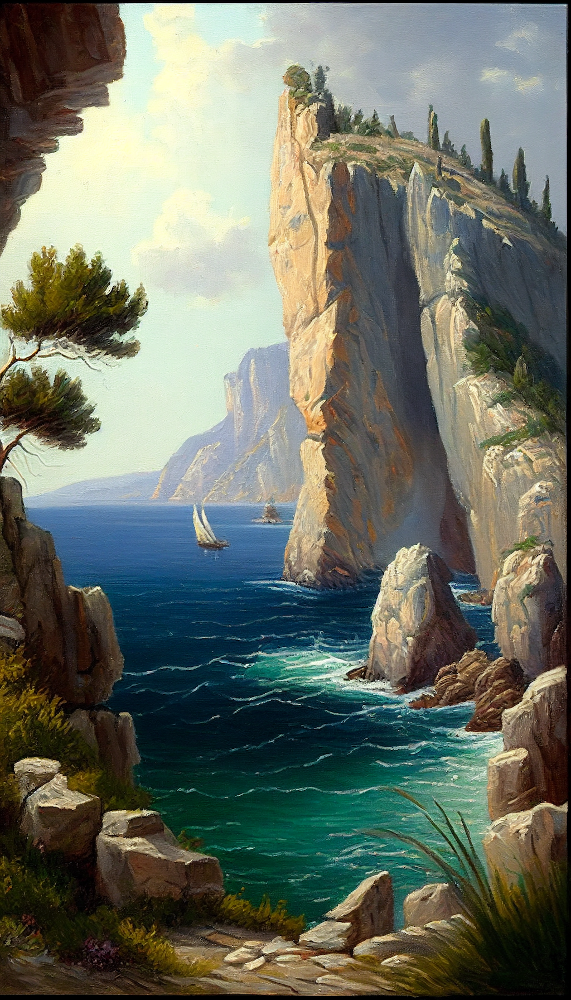
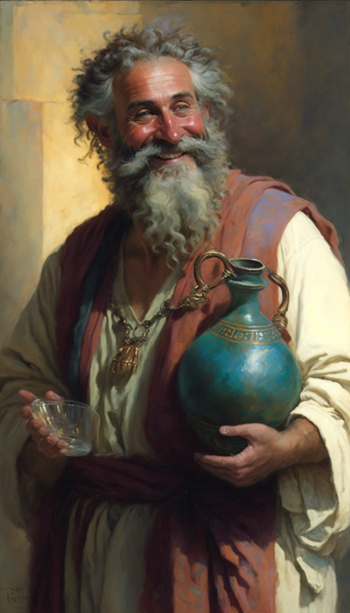
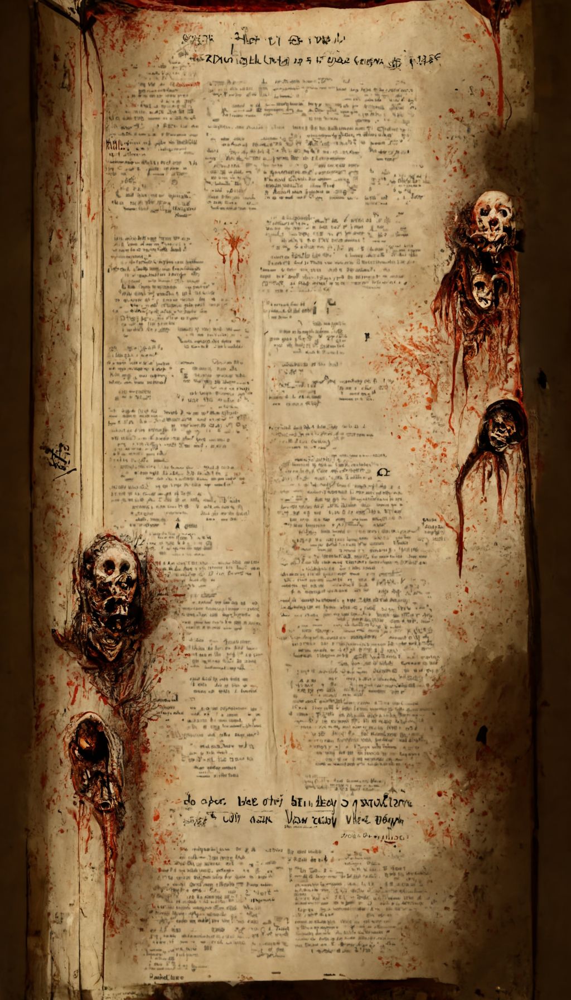

**Ahoj, noble seeker of knowledge!**  

You found the wiki for my Dungeons and Dragons campaign. If you are new here I suggest reading the [overview](./overview.md) or click on the pictures for one of the following topics: places, people or lore.

    

        
    

    

        
    

    

        
    

Alternatively, if you already know what you are looking for, I suggest browsing the [glossary](./glossary.md).

Please note that this wiki is a constant work in progress and content is most likely due to change as the PCs bring inevitable chaos upon this beautiful world.

Also note that this serves as a reference for the game master too and thusly may contain spoilers, hence, **if you are a player, DO NOT browse the repo or click on pages marked as spoiler, it will ruin the game for you!**

You have been warned. Happy reading!

Cheers,  
Max