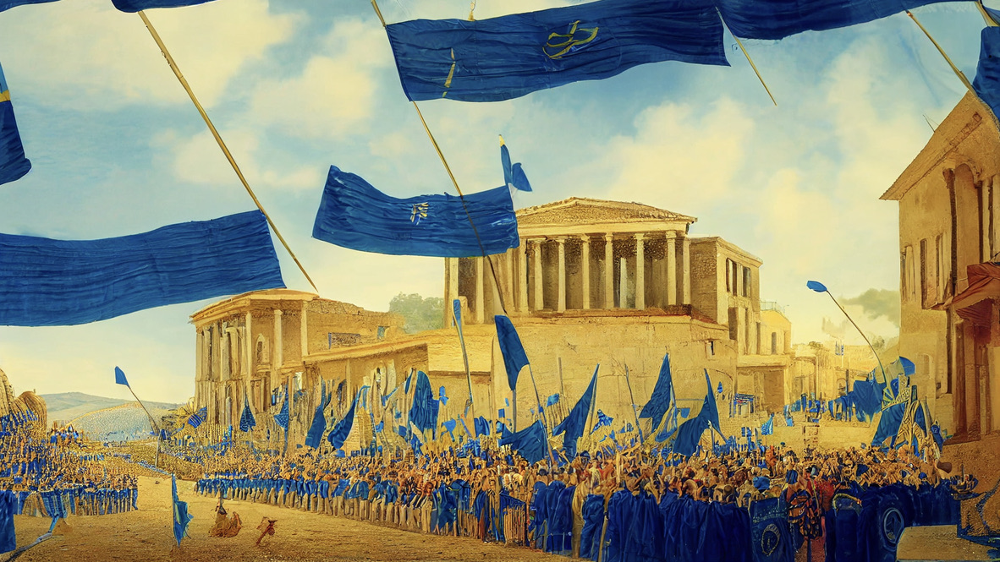

# The Kingdom of Epsylón

Claiming to be the oldest of the three big factions, the Kingdom of Epsylón spans along the Northern Shores of the Summer Sea. Currently ruled by King Mirko, the kingdom is involved into the Three Kingdom War.

---

## History

Before the Kingdom of Epsylón was founded the people of the Summer Sea lived in eternal chaos as countless small tribes and clans roamed the lands and pillaged each other, much like the savages of the south do to this very day. At some point however, the first clans agreed to join forces so they can better defend themselves. After more and more tribes were added to this construct and thusly the settlements and villages grew into towns a new form of government was needed.

According to legend, a young human, Ephara, was send by the gods to help the people of the Summer Sea to organise. She reformed the united tribes into the kingdom of Epsylón and appointed its first king, Summand of Epsylón. Once her work was done and the kingdom was running smoothly, Ephara acended to the heavens and has became Godess of Culture and Civics.

Many years later, due to internal conflicts under the Rule of King Partus, the Kingdom of Nabla separated from the Kingdom of Epsylón, deriving from and building on their principles. 

---

## Culture

Populated mostly by humans, centaurs and elves, the Kingdom of Epsylón tends more to culture and the arcane arts. They celebrate pretty much all variations of all the festivals of the Summeer Sea, enjoy meeting in forums and like to engage in philosophical debates, which makes them look somewhat snob and arrogant in the eyes of outsiders. 

While they are not the strongest or toughest warriors, they certainly have the cleverest ones in their ranks. In war they hence tend to avoid melee combat and rely on magic and ranged tactics to defeat any threats to their society.

---

## Geography

### Región Okeanopolis
* Okeanopolis
* Barnaclae
* Dóros
* Khyria
* Cyclops Mountains
* Skónan's Valley

### Región Hydropolis
* Hydropolis
* Ícosaedrai
* Pi
* Thassébes
* The Great Glacier

### Región Narcopolis
* Narcopolis
* Minas Rhíw
* Minas Falathren
* Hyppopolis
* Horsemen Mountains
* The Silent Sea

---
## Further Reading
This has been an article about the [*Kingdom of Epsylon*](./glossary.md#kingdom-of-epsylón). For further reading please check out the [*Encyclopedia*](./index.md).