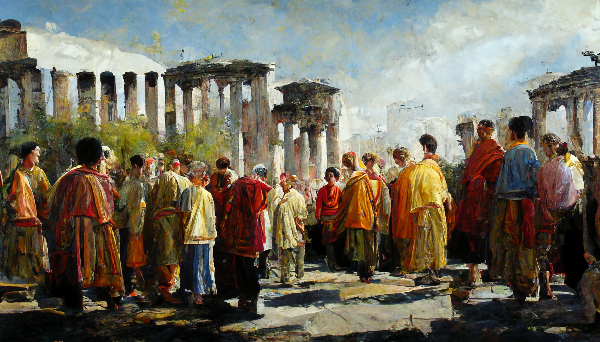

# The Kingdom of Epsylón

Claiming to be the oldest of the three big factions, the [*Kingdom of Epsylón*](./glossary.md#kingdom-of-epsylon) spans along the [Northern Shores](./glossary.md#summer-sea) of the [*Summer Sea*](./glossary.md#summer-sea). Currently ruled by [*King Mirko*](./glossary.md#king-mirko), the kingdom is involved into the [*Three Kingdom War*](./glossary.md#three-kingdom-war).

---

## History

Before the [*Kingdom of Epsylón*](./glossary.md#kingdom-of-epsylón) was founded, the people of the [*Summer Sea*](./glossary.md#summer-sea) lived in eternal chaos as countless small tribes and clans. They roamed the lands and pillaged each other, much like the [*savages of the south*](./glossary.md#savage-lands) do to this very day. At some point however, the first clans agreed to join forces so they can better defend themselves. After more and more tribes were added to this construct and thusly the settlements and villages grew into towns a new form of government was needed.

According to legend, a young woman, [*Ephara*](./glossary.md#ephara), was send by the [*gods*](./glossary.md#pantheon) to help the people of the [*Summer Sea*](./glossary.md#summer-sea) to organise. She reformed the united tribes into the [*Kingdom of Epsylón*](./glossary.md#kingdom-of-epsylón) and appointed its first ruler, [*King Sigma Summand of Epsylón*](./glossary.md#king-sigma). Once her work was done and the kingdom was running smoothly, [*Ephara*](./glossary.md#ephara) ascended to the heavens and has became Godess of Culture and Civics.

Many years later, due to internal conflicts under the Rule of [*King Partus*](./glossary.md#king-partus), the [*Kingdom of Nabla*](./glossary.md#kingdom-of-nabla) separated from the [*Kingdom of Epsylón*](./glossary.md#kingdom-of-epsylón), deriving from and building on their principles. 

---

## Culture

Populated mostly by [*humans*](./glossary.md#human), [*centaurs*](./glossary.md#centaur) and [*elves*](./glossary.md#elf), the [*Kingdom of Epsylón*](./glossary.md#kingdom-of-epsylón) tends more to culture and the arcane arts. They celebrate pretty much all variations of all the [*festivals of the Summeer Sea*](./glossary.md#calendar), enjoy meeting in forums and like to engage in philosophical debates, which makes them look somewhat snob and arrogant in the eyes of outsiders. 

While they are not the strongest or toughest warriors, they certainly have the cleverest ones in their ranks. In war they hence tend to avoid melee combat and rely on magic and ranged tactics to defeat any threats to their society.

### The Forum of Okeanopolis

The [*Forum of Okeanopolis*](./glossary.md#forum-of-okeanopolis) is a big town square in the middle of [*Okeanopolis*](./glossary.md#okeanopolis). Discussions are being held on almost a daily basis, regardless of weather. All sentient beings are allowed to participate, as long as they maintain a non vulgar vocabulary and stay civil during debates. Depending on the daily agenda and expected participants, discussions are either held in a big gathering ruled and moderated by a chair or in small separated discussion circles. While results of discussions are non binding, many politicians still frequent the [*Forum*](./glossary.md#forum-of-okeanopolis) in order to get a feel for the needs and troubles of the general public. 

---

## Geography

### Región Okeanopolis
- **Okeanopolis**  
    Located just south of the [*Gate to Oblivion*](./glossary.md#gate-to-oblivion), [*Okeanopolis*](./glossary.md#okeanopolis) is the biggest and one of the oldest cities in the [*Summer Sea*](./glossary.md#summer-sea) as well as the capital city of the [*Kingdom of Epsylón*](./glossary.md#kingdom-of-epsylón). Thanks to its central location on the map, this city has become a major traffic and trading hub for all of the [*Summer Sea*](./glossary.md#summer-sea). Featuring the great [*Forum of Okeanopolis*](./glossary.md#forum-of-okeanopolis) and many shops and markets with goods from every corner of the [*warm regions*](./glossary.md#summer-sea).

- **Barnaclae**    
    [*Barnaclae*](./glossary.md#barnaclae) is famous for its many floating fishing huts that farm barnacles out in [*Barnacle Bay*](./glossary.md#barnacle-bay). While the stench is unbearable the barnacles make for a healthy snack and, according to locals, provide an extra layer of protection for all ships build in this town.

- **Dóros**  
    [*Dóros*](./glossary.md#dóros) is a quiet town, deep inside the [*Dark Forest*](./glossary.md#dark-forest), just at the border to the [*Kingdom of Nabla*](./glossary.md#kingdom-of-nabla) which follows the river [*Krúos*](./glossary.md#krúos). Due to its vicinity to [*Annikha*](./glossary.md#annikha), a [*nablonian*](./glossary.md#kingdom-of-nabla) town, it has been the sight of many battles of the [*Three Kingdom War*](./glossary.md#three-kingdom-war). Many [*epsylónian*](./glossary.md#kingdom-of-epsylón) adventurers establish camps here before their venture deeper into the [*Dark Forest*](./glossary.md#dark-forest).

- **Khyria**  
    Thanks to good access to ore filled mountains, thick but safe forests and the [*Summer Sea*](./glossary.md#summer-sea), [*Khyria*](./glossary.md#khyria) is famous for the local ship building industry. Apart from that, this town is rather quiet and culturally boring.

- **Cyclops Mountains**  
    The [*Cyclops Mountains*](./glossary.md#cyclops-mountains) reach deep into the [*Summer Sea*](./glossary.md#summer-sea). While there are a few relatively safe routes through them, traders are encouraged to take the longer but much safer sea route when trying to get across. Wild, hungry beasts and curious [*cyclopii*](./glossary.md#cyclops) roam the valleys and terrorise any who dare enter their territory.

- **Skónan's Valley**  
    Named after [*Skónan the Ancient*](./glossary.md#skónan-the-ancient), the most famous [*cyclops*](./glossary.md#cyclops) to ever roam the [*Summer Sea*](./glossary.md#summer-sea), this [*valley*](./glossary.md#valley-of-skónan) is home to the last intact [*cyclopean*](./glossary.md#cyclops) colony. Only daring adventurers and crazy people ever enter this valley where many end up eaten, crushed, torn apart or any combination of those three.

- **Gate to Oblivion**
    Also called the [*Doomhole*](./glossary.md#gate-to-oblivion) or [*Hole of Doom*](./glossary.md#gate-to-oblivion), this giant, pitch black hole in the ground strikes fear into everyone who has ever seen it. Noone knows how it came to be or what is inside, as all who dared to enter never returned.

### Región Hydropolis
- **Hydropolis**
- **Ícosaedrai**
- **Pi**
- **Thassébes**
- **The Great Glacier**

### Región Narcopolis
- **Narcopolis**
- **Minas Rhíw**
- **Minas Falathren**
- **Hyppopolis**
- **Horsemen Mountains**
- **The Silent Sea**

---
## Further Reading
This has been an article about the [*Kingdom of Epsylon*](./glossary.md#kingdom-of-epsylón). For further reading please check out the [*Encyclopedia*](./index.md).