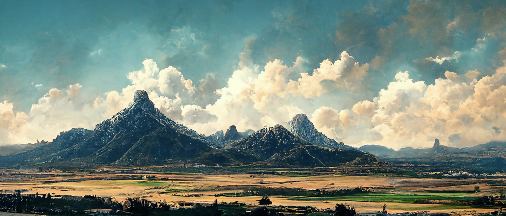
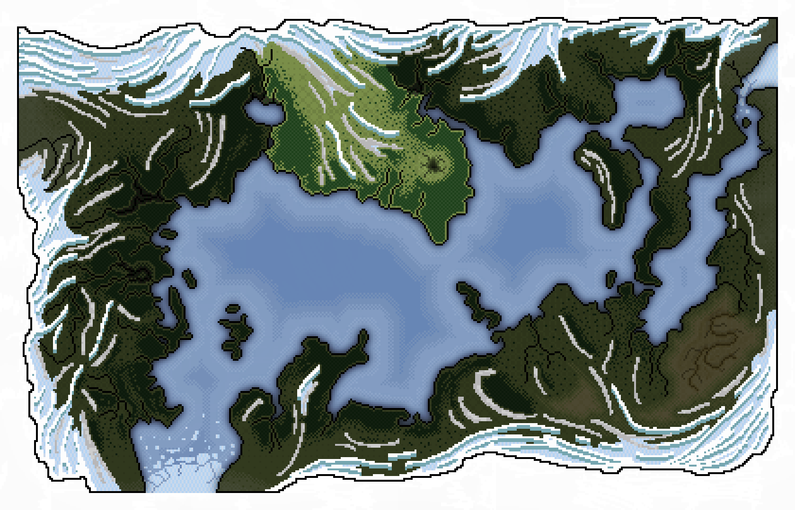
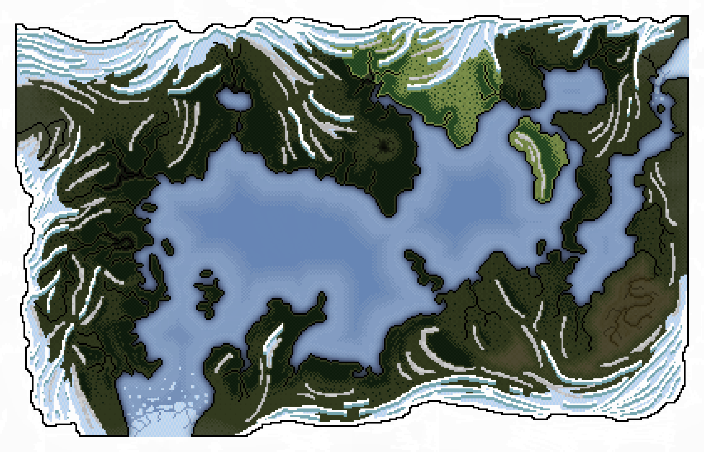
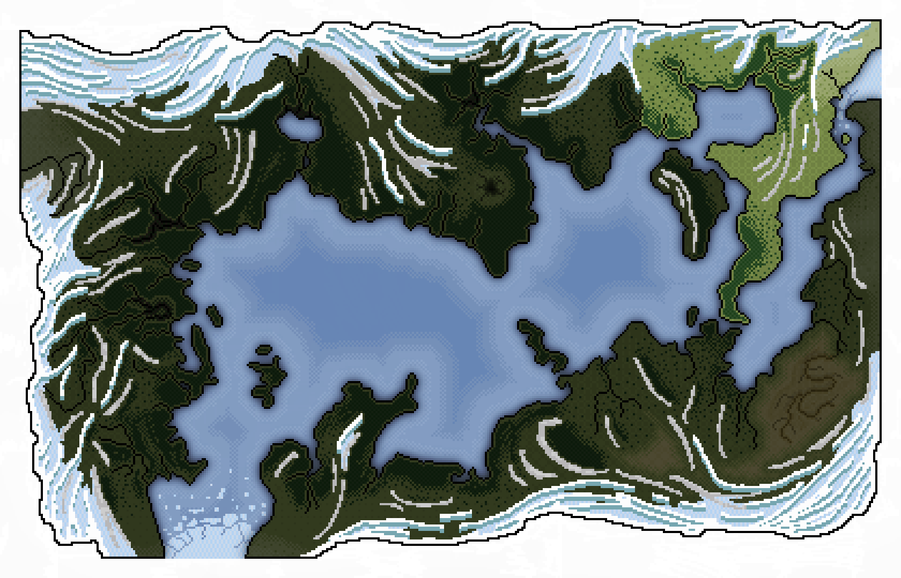

# The Northern Shores
Eventhough the Elders all agree that modern civilisation as we know it was established by [*Ephara*](./glossary.md#ephara) at the foot of the [*Sacred Mountain*](./glossary.md#sacred-mountain), the [*Northern Shores*](./glossary.md#northern-shores) are now considered the home of the cultured and civilised. It was here where [*King Summant*](./glossary.md#king-summant) unified the tribes of [*elves*](./glossary.md#elves), [*men*](./glossary.md#humans), [*centaurs*](./glossary.md#centaurs) and [*dwarves*](./glossary.md#dwarves) againt the [*cyclopean*](./glossary.md#cyclops) tyranny and founded the ancient [*Kingdom of Epsylón*](./glossary.md#kingdom-of-epsylón).

---

## Province of Okeánia

[*Okeánia*](./glossary.md#okeánia) is both the largest and westernmost province of the [*Northern Shores*](./glossary.md#northern-shores). The capitol of the [*Kingdom of Epsylón*](./glossary.md#kingdom-of-epsylón), [*Okeánopolis*](./glossary.md#okeánopolis) can be found here, along with the towns of [*Dóros*](./glossary.md#dóros) and [*Barnaclae*](./glossary.md#barnaclae) as well as the [*Gate to Oblivion*](./glossary.md#gate-to-oblivion) and the legendary [*Valley of Skónan*](./glossary.md#skónans-valley).

Read more about [**Okeánopolis**](./okeanopolis.md), [**Dóros**](./darkforest.md#the-town-of-dóros), [**Barnaclae**](./barnaclae.md), [**Gate to Oblivion**](./gatetooblivion.md) and the [**Cyclops Mountains**](./cyclopsMountains.md).

---

## Province of Khyría

[*Khyría*](./glossary.md#khyría) is the central province of the [*Northern Shores*](./glossary.md#northern-shores). The city of [*Hydropolis*](./glossary.md#hydropolis) along with the name giving town of [*Khyría*](./glossary.md#khyría) and [*Pí*](./glossary.md#pí) can be found here as well as the [*Great Glacier*](./glossary.md#great-glacier) in the north.

Read more about [**Hydropolis**](./hydropolis.md), [**Khyría**](./khyria.md), [**Pí**](./maxos.md#the-town-of-pí) and the [**Great Glacier**](./khyria.md#the-great-glacier).

---

## Province of Hyppónia

[*Hyppónia*](./glossary.md#hyppónia) is the coldest and easternmost province of the [*Northern Shores*](./glossary.md#northern-shores). The city of [*Narcopolis*](./glossary.md#narcopolis), the towns of [*Thassébes*](./glossary.md#thassébes), [*Ícosaedrai*](./glossary.md#ícosaedrai) and [*Hyppopolis*](./glossary.md#hyppopolis) as well as the ancient elven settlements of [*Mínas Rhíw*](./glossary.md#mínas-rhíw) and [*Mínas Falathren*](./glossary.md#mínas-falathren) can be found here along with the mighty [*Horsemen Mountains*](./glossary.md#horsemen-mountains) to the far east.

Read more about [**Narcopolis**](./narcopolis.md), [**Thassébes**](./thassebes.md), [**Ícosaedrai**](./icosaedrai.md), the [**elven settlements**](./silentSea.md#mínas-falathren) and the [**Horsemen Mountains**](./horsemenMountains.md)

---

## Islands

While there are many small and [*wandering isles*](./glossary.md#wandering-isles) in the waters of the [*Northern Shores*](./glossary.md#northern-shores) there is only one, major settled island, [**Maxos**](./maxos.md). Legally it belongs to the province of [*Khyría*](./glossary.md#khyría) eventhough geographically it is closer to [*Hyppónia*](./glossary.md#hyppónia).

---

Go back: [Index](./index.md) / [Places](./places.md)