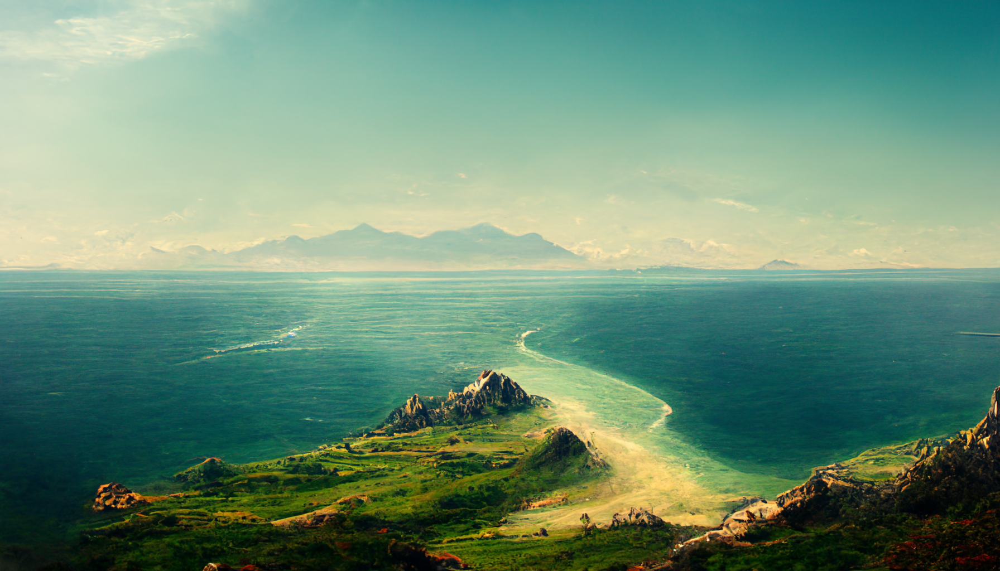
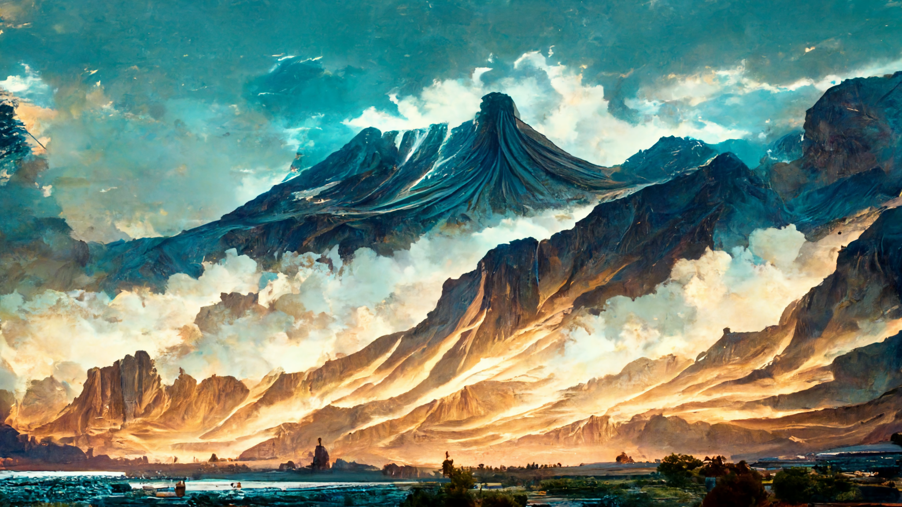
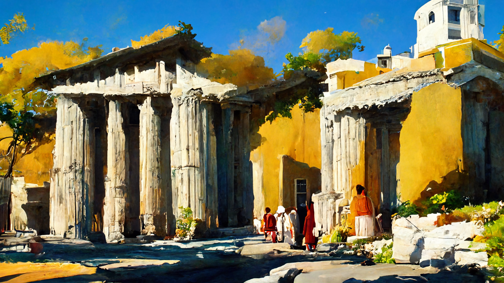

# Lands of the Summer Sea - An Overview

**Welcome adventurer!** This article serves as an overview of the Land of the Summer Sea, much like a tourist information pamphlet if you will :-)   

---

## The World
### The Planet
The planet [*Akínitos*](./glossary.md#akínitos) is almost entirely covered by ice, however thanks to what appears to be a geothermal anomaly, a relatively small area stays above the freezing point for almost the entire year, called the [*Summer Sea*](./glossary.md#summer-sea). This valley of warmth is surrounded by an [*ice wall*](./glossary.md#ice-wall) almost a mile high. During summer, huge clumps of ice break away and fall onto the lands below, supplying them with fresh water just to be reformed during the unforgiving blizzards of the winter months.

### Continents
While the sages and wizards all agree that the [*Summer Sea*](./glossary.md#summer-sea) is located on a single massive, little is known about the shapes and number of continents. Rare groundquakes as well as reports of enormous cracks in the ice far away from the warm region however suggest continental movement.
 
### Fauna & Flora
Cold rivers flow from the glaciers at the [*Ice Wall*](./glossary.md#ice-wall) toward the [*Summer Sea*](./glossary.md#summer-sea) forming various lakes and marshes along the way. Thick forests cover the lands to the northeast while lush plains and steppes can be found in the west. Down south vast savannahs slowly lead into a deadly desert. 

Rich game and fastastic beasts can be found lurking the forests while the planes are roamed by proud centaurs and their herds. The [*Summer Sea*](./glossary.md#summer-sea) is rich with all sorts of creatures too, from tiny fish to enourmous krakens that can devour entire ships. The coasts are pretty much entirely settled by all sorts of sentient humanoids, such as elves, humans and the occasional orc and tiefling while the gnomes and dwarves prefer to settle further inland into the mountains. 

---

## Myths and Legends
### How the World came to be
There are many stories on how the world came to be, each claiming that a different god initiated the creation of [*Akínitos*](./glossary.md#akínitos) however all these stories do agree that before the world came to be all gods lived in harmony atop the [*Sacred Mountain*](./glossary.md#sacred-mountain). One day however, the gods got into a nasty dispute and clashed.

During the battle an explosion occured, so intense that it destroyed the [*Sacred Mountain*](./glossary.md#sacred-mountain) and melted away some of the ice, thus creating the [*Summer Sea*](./glossary.md#summer-sea). Even the gods themselves were flung into all possible directions: [*Heliod*](./glossary.md#heliod), God of the Light for example got thrown so far up into the sky that he now circles [*Akínitos*](./glossary.md#akínitos) once every 24 hours.

### The Gods and their disputes
The [*Akínitoian pantheon*](./glossary.md#pantheon) consists of fifteen gods, each representing another aspect of the world. There is [*Ephara*](./glossary.md#ephara), Godess of Cities or [*Iroas*](./glossary.md#iroas), God of Victory and many more.

After the [*Great Dispute*](./glossary.md#great-dispute) all gods were separated, and thus each of them is worshipped seperately, yet many pray to more than one diety, just to be sure their pleas are heard. There are some who belive that when all Gods are reunited, all live may transcend into a symbiotic utopia, while others fear that the Gods may resume their ancient dispute once more and wipe out all of the [*Summer Sea*](./glossary.md#summer-sea) in the process.

### Recent History
Ever since the beginning of time, or recorded history for that matter, there has been at least one big, bloddy conflict going on somewhere in the [*Summer Sea*](./glossary.md#summer-sea). The most recent one, the [*Three Kingdom War*](./glossary.md#three-kingdom-war) has been raging for nearly a decade now.

What started as an attempt to annect the island of [*Kiffalón*](./glossary.md#kiffalón) by the [*Kingdom of Epsylón*](./glossary.md#kingdom-of-epsylón) has since escalated into a confusing territorial battle between them and the [*Kingdom of Nabla*](./glossary.md#kingdom-of-nabla) - all while both sides are trying to fend off the invading hordes from the [*Savage Lands*](./glossary.md#savage-lands) in the south.

---

## Culture and Politics
### The Three Kingdoms
Currently the Lands of the [*Summer Sea*](./glossary.md#summer-sea) are divided into three kingdoms; the [*Kingdom of Epsylón*](./glossary.md#kingdom-of-epsylón) occupying most of the northern shores, [*Kingdom of Nabla*](./glossary.md#kingdom-of-nabla) to the east and the so called [*Horde of the Savage Lands*](./glossary.md#savage-lands) in the south.

Both kingdoms have a very similar political structure: They are ruled by a monarch who's royal blood ensures their claim of the Throne and who employ governors to rule the provinces in their name. The horde however is ruled by their strongest warrior, who can be challenged for the throne. This princliple is commonly applied throughout the entire horde.

### Points of Interest
There are many beautiful and magical places to see in the [*Summer Sea*](./glossary.md#summer-sea), to list or visit them all would be impossible. These however stand out from the crowd and should be on every adventurer's bucket list:

- **Maxipolis**  
  This rich and sprawling Megapolis is the capitol of the [*Kingdom of Nabla*](./glossary.md#kingdom-of-nabla) and claims to be the oldest city in the [*Summer Sea*](./glossary.md#summer-sea) founded by [*Ephara*](./glossary.md#ephara), the Godess of Cities herself.

- **Kiffalón**  
  The island of [*Kiffalón*](./glossary.md#kiffalón) is the third largest island in the [*Summer Sea*](./glossary.md#summer-sea) and despite being scarred by the [*Three Kingdom War*](./glossary.md#three-kingdom-war) a very peacefull place. The natives are known for their mellow character and great, tasty feasts. 

- **Marshes of Malaria**  
  Spanning for many miles along the rivers [*Malara*](./glossary.md#malara-river), [*Kolera*](./glossary.md#kolera-river) and [*Ebóla*](./glossary.md#ebola-river) the Marshes of Malaria pose a deathly obstacle for merchants and adventurers who wish to avoid the bandits at the coast and the criminally high tolls of the dwarven highways through the mountains.

- **Deep Hole of Doom**  
  The Deep Hole of Doom is a giant hole in the ground spanning several miles across. Of all who have descended into its dark depths none has returned which is why the hole is sometimes also called the [*Gate to Oblivion*](./glossary.md#gate-to-oblivion).

- **Great Canyon of Corpses**  
  Deep inside the [*Desert of certain Death*](./glossary.md#desert-of-certain-death) lays the [*Great Canyon of Corpses*](./glossary.md#great-canyon-of-corpses). As the name suggests, this is the last resting place for countles desparate souls who sought refuge from the scorching heat and freezing cold of the desert above.

### Calendar
One of the most useful inventions in the history of the [*Summer Sea*](./glossary.md#summer-sea) is the [*calendar*](./glossary.md#calendar). It allows us to measure time and even predict natural events such as the next sunrise, full moon or winter season. 

The wizards and sages have observed that [*Heliod*](./glossary.md#heliod), God of the Light circles the planet very regularly and have mostly agreed that every time Heliod appears above the horizon, a new 'day' shall begin. Five such days make up a 'week'.

For a long time four weeks made up a 'month' which perfectly coincided with the phases of the moon and a 'year' had fourteen months. One day however, out of jealousy [*Phenax*](./glossary.md#phenax), God of Deception messed with the trajectory of the Moon and threw civilisation into the [*Dark Age of Confusion*](./glossary.md#dark-age-of-confusion).
For many hours, or centuries perhaps, noone knew what date it was until finally a month was observed to be exactly 31 days long.

This shift in the heavens extended the year by another month, ensuring that all 15 gods now each have their own month which is 31 days or four-and-a-bit weeks long. 

---
## Further Reading
This has been an overview of the Lands of the [*Summer Sea*](./glossary.md#summer-sea) and its inhabitants. For further reading please check out the [*Encyclopedia*](./index.md).