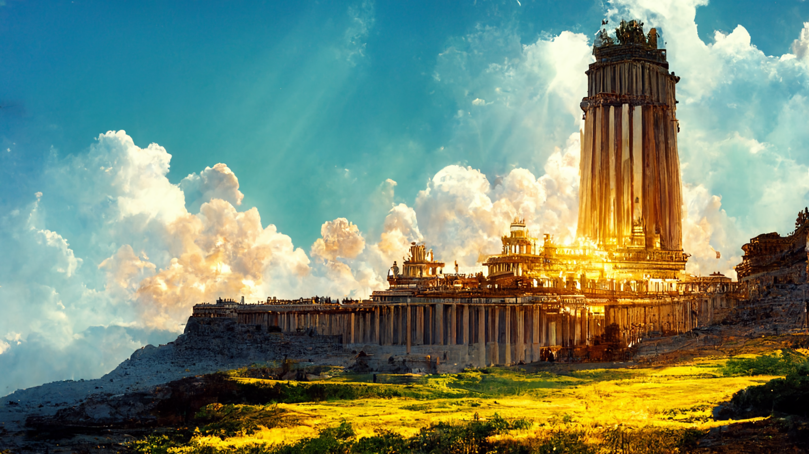
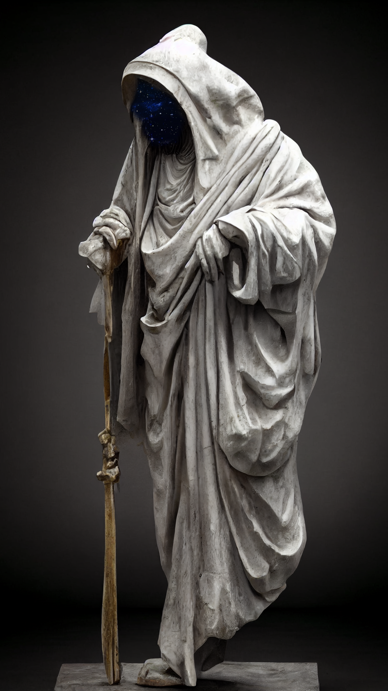
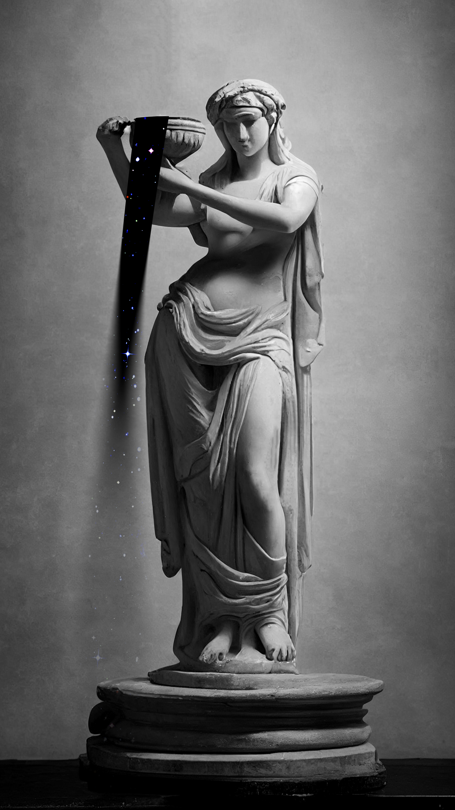

# The Pantheon of Akínitos

The pantheon of [*Akínitos*](./glossary.md#akínitos) is formed by fifteen gods who according to legends all meet in a golden palace atop the [*Sacred Mountain*](./glossary.md#sacred-mountain) and decide upon the destiny of the [*Summer Sea*](./glossary.md#summer-sea). Furthermore each god has their own domain of life for which they are responsible - these are explained below.

While all gods have their dedicated priests and followers, the average mortal living along the [*Summer Sea*](./glossary.md#summer-sea) worships multiple gods at the same time, depending on their surroundings and profession. 

---

## The fifteen Gods of Akínitos
### Athreos
**God of Passage**

---

### Ephara
**God of Culture and Civics**

---

### Erebos
**God of the Dead**

---

### Heliod
**God of the Sun**

---

### Iroas
**God of Victory**

---

### Karametra
**God of Harvests**

---

### Keranos
**God of Storms**

---

### Klothys
**God of Destiny**

---

### Kruphix
**God of Horizons**

---

### Mogis
**God of Slaugther**

---

### Nylea
**God of the Hunt**

---

### Pharika
**God of Affliction**

---

### Phenax
**God of Deception**

---

### Purphoros
**God of the Forge**

---

### Thassa
**God of the Sea**

---
## Sacred Mountain

---

## The Great Dispute

---
## Further Reading
This has been an article about the [*Pantheon*](glossary.md#pantheon) of [*Akínitos*](./glossary.md#akínitos). For further reading please check out the [*Encyclopedia*](./index.md).