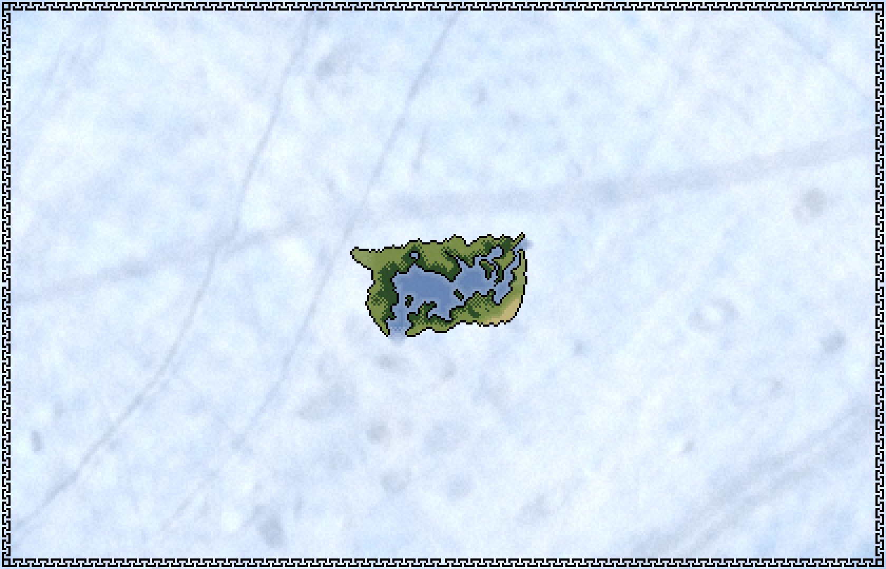

# Places

The planet [*Akínitos*](/glossary.md#akínitos) is almost entirely covered by ice, however thanks to what appears to be a [geothermal anomaly](./lore/geothermalanomaly.md), a relatively small area stays above the freezing point for almost the entire year, the [*Summer Sea*](./glossary.md#summer-sea). This valley of warmth is surrounded by an [*ice wall*](./glossary.md#ice-wall) almost a mile high. During summer, huge clumps of ice break away and fall onto the lands below, supplying them with fresh water just to be reformed during the unforgiving blizzards of the winter months.

---

Read more about the [Known World](./summersea.md).

Read more about what lies [beyond the Ice Wall](./icewall.md).

Go back to [Home](./index.md).