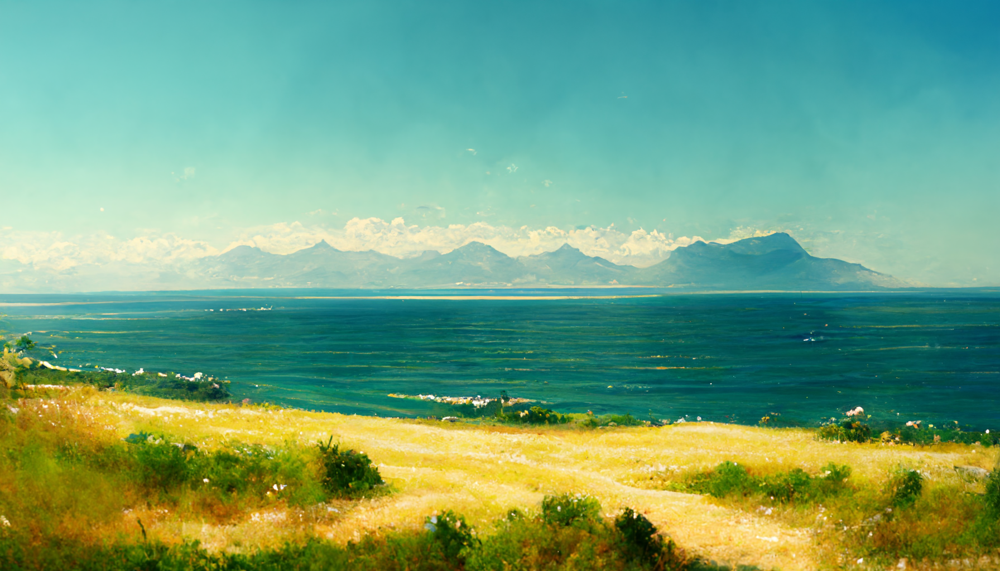

# Known Lands of the Summer Sea

The Lands of the [Summer Sea](./glossary.md#summer-sea) are encircled by the [Ice Wall](./glossary.md#ice-wall) and commonly separated into three main regions, each further separated into three more provinces.

---

## Northern Shores

The [Northern Shores](./glossary.md#northern-shores) all belong to the [Kingdom of Epsylón](./glossary.md#kingdom-of-epsylón). They are split (west to east) into the provinces of [Okeánia](./glossary.md#okeánia), [Khyría](./glossary.md#khyría) and [Hyppónia](./glossary.md#hyppónia).

The great [Cyclops Mountains](./glossary.md#cyclops-mountains) as well as the legendary [Valley of Skónan](./glossary.md#skónans-valley) can be found here, along with the [Great Glacier](./glossary.md#great-glacier), the [Horseman Mountains](./glossary.md#horseman-mountains) and the [Gate to Oblivion](./glossary.md#gate-to-oblivion).

[**read more**](./northernshores.md)

---

## Western Shores

The [Western Shores](./glossary.md#western-shores) all belong to the [Kingdom of Nabla](./glossary.md#kingdom-of-nabla). They are split (north to south) into the provinces of [Boréa](./glossary.md#boréa), [Malária](./glossary.md#malária) and [Théa](./glossary.md#théa).

The cold [Frostwind Steppe](./glossary.md#frostwind-steppe) as well as the dangerous [Marshes of Malária](./glossary.md#marshes-of-malária) can be found here, along with the [Sea of Drifting Ice](./glossary.md#sea-of-drifting-ice) in the south.

[**read more**](./westernshores.md)

---

## Southern Shores

The [Southern Shores](./glossary.md#southern-shores) all belong to the [Savages of the South](./glossary.md#savage-lands). They are split (west to east) into the [Nym](./glossary.md#nym), the [Lion Fields](./glossary.md#lion-fields) and [Necrón](./glossary.md#necrón) - also called the Lands of the Dead.

The deadly [Desert of Certain Death](./glossary.md#desert-of-certain-death) with the [Great Canyon of Corpses](./glossary.md#great-canyon-of-corpses) can be found here, just like the deep forests of the [Nym](./glossary.md#nym) and the [Sacred Mountain](./glossary.md#sacred-mountain) rising above.

[**read more**](./southernshores.md)

---

Go back: [Index](./index.md) / [Places](./places.md)