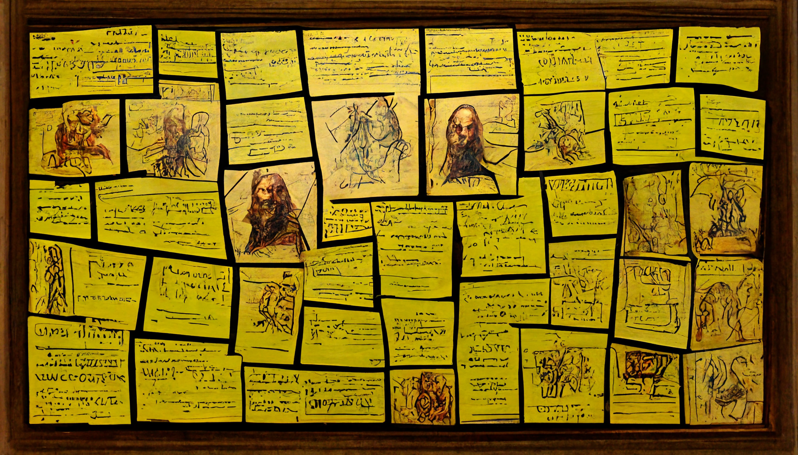

# The Plot

!!! SPOILER WARNING !!! 
If you are a player, DO NOT read any further

---

In order to achieve goodhood, a dark evil entity called [*Prince Morbogh of Eternal Doom*](./glossary.md#prince-morbogh-of-eternal-doom) from the [*Darkness before Time*](./glossary.md#darkness-before-time) made a pact with the sorceress [*Mellisanthé the Cruel*](./glossary.md#mellisanthé-the-cruel): he provides the sorceress with exceptional dark powers and so that she in return executes his mischievous plans of world domination.

This [*evil masterplan*](./glossary.md#cult-of-silence) is has three requirements that need to be fullfilled before it can be executed: the securing of knowledge, might and magic. Once all three have been satisfied, the final stage begins. [*Mellisanthé*](./glossary.md#mellisanthé-the-cruel) and her minions will be constantly and devotedly working toward this goal.

At the beginning of the campaign most of the foundation work for all three pillars of the masterplan has been completed and further advancements are underway in the background. A well spread network of agents and spies has been established to provide [*Mellisanthé*](./glossary.md#mellisanthé-the-cruel) with information. Magical powers and the favor of [*Morbogh*](./glossary.md#prince-morbogh-of-eternal-doom) are being secured by the [*Cult of Silence*](./glossary.md#cult-of-silence). The sorceress herself has just finished work on her super warrior, the Throngler and has now begun research into necromancy in order to raise the [*Eternal Army*](./glossary.md#eternal-army).

---

## Act I - The signs of evil

Suspicious shifts in power as well as strange observations by concerned villagers have created a local call for heroes, so they may look into these mysteries. 

### Quests
> Brutal murder of a beloved mayor  
> (yields intel on the [*Cult*](./glossary.md#cult-of-silence))

> Desecrated and up graves, looted tombs  
> (yields intel on the [*Eternal Army*](./glossary.md#eternal-army))

> Stolen livestock  
> (yields intel on the [*Throngler*](./glossary.md#the-throngler))

By the end of the first act [*Mellisanthé*](./glossary.md#mellisanthé-the-cruel) will have found the key for raising an army of the undead, triggering a final quest:

> Stolen Scroll of Eternal Youth  
> (yields intel on [*Mellisanthé*](./glossary.md#mellisanthé-the-cruel), the [*Eternal Army*](./glossary.md#eternal-army) as well as the [*Masterplan*](./glossary.md#cult-of-silence))

---

## Act II - Wrath of Gods

As [*Morbogh's*](./glossary.md#prince-morbogh-of-eternal-doom) three pillars plan is in full motion, even the [*Gods*](./glossary.md#pantheon) begin to take notice and send down a [*massive storm*](./glossary.md#cleansing-wind) to cleanse and punish the mortals. Little do they know that the vast amount of fresh corpses is exactly what [*Mellisanthé*](./glossary.md#mellisanthé-the-cruel) needs to raise her [*army*](./glossary.md#eternal-army).

### Quests
> The puppet King of Nabla  
> (yields intel on the [*Cult*](./glossary.md#cult-of-silence))

> The Strongest warrior in the Horde  
> (yields intel on the [*Throngler*](./glossary.md#the-throngler))

> A Journey through Space and Time  
> (yields intel on [*Morbogh*](./glossary.md#prince-morbogh-of-eternal-doom))

By now the [*Cleansing Winds*](./glossary.md#cleansing-wind) have claimed the lives of many poor souls, all of which have been snatched by [*Mellisanthé*](./glossary.md#mellisanthé-the-cruel) and forced to join the ranks of her [*Eternal Army*](./glossary.md#eternal-army). Not being able to tell what is going on, the [*Gods*](./glossary.md#pantheon) grow more angry triggering the following decision quest:

> The Fate of the Summer Sea  
> (yields intel on [*Mellisanthé*](./glossary.md#mellisanthé-the-cruel), [*Morbogh*](./glossary.md#prince-morbogh-of-eternal-doom) and their [*Masterplan*](./glossary.md#cult-of-silence))

Here the players may choose to either climb the [*Sacred Mountain*](./glossary.md#sacred-mountain) to warn the [*Gods*](./glossary.md#pantheon) or descent into the [*Gate to Oblivion*](./glossary.md#gate-to-oblivion) to side with [*Morbogh*](./glossary.md#prince-morbogh-of-eternal-doom) and throw [*Mellisanthé*](./glossary.md#mellisanthé-the-cruel) under the bus. 

Whichever path they choose, it will give the opposing side headstart: travelling to the [*Sacred Mountain*](./glossary.md#sacred-mountain) will let the storm rage on, leaving more material for the [*Eternal Army*](./glossary.md#eternal-army). Descending into the [*Gate to Oblivion*](./glossary.md#gate-to-oblivion) will be seen as betrayal be the mortals, strenghtening their resolve in defending against the forces of evil.

---

## Act III - The Endgame

With the Gods informed, the [*Cleansing Winds*](./glossary.md#cleansing-wind) stop and a new, heroic army is being raised to ward off the now complete and advancing [*Eternal Army*](./glossary.md#eternal-army).

> The Battle of [*Kiffalón*](./glossary.md#kiffalón)  
> (yields any missing intel on the opposing party)

Depending on what side the players choose and how well they perform this last act will lead to one of the following epic end quests:

> Flushed into [*Oblivion*](./glossary.md#gate-to-oblivion)  
> (triggers if the players sided with the [*Gods*](./glossary.md#pantheon) and won the Battle of [*Kiffalón*](./glossary.md#kiffalón))

> Defend the [*Sacred Mountain*](./glossary.md#sacred-mountain)  
> (triggers if the players sided with the [*Gods*](./glossary.md#pantheon) but lost the Battle of [*Kiffalón*](./glossary.md#kiffalón))

> Storm the [*Sacred Mountain*](./glossary.md#sacred-mountain)  
> (triggers if the players sided with [*Morbogh*](./glossary.md#prince-morbogh-of-eternal-doom) and won the Battle of [*Kiffalón*](./glossary.md#kiffalón))

> Down the [*Rabbit Hole*](./glossary.md#gate-to-oblivion)  
> (triggers if the players sided with [*Morbogh*](./glossary.md#prince-morbogh-of-eternal-doom) but lost the Battle of [*Kiffalón*](./glossary.md#kiffalón))

