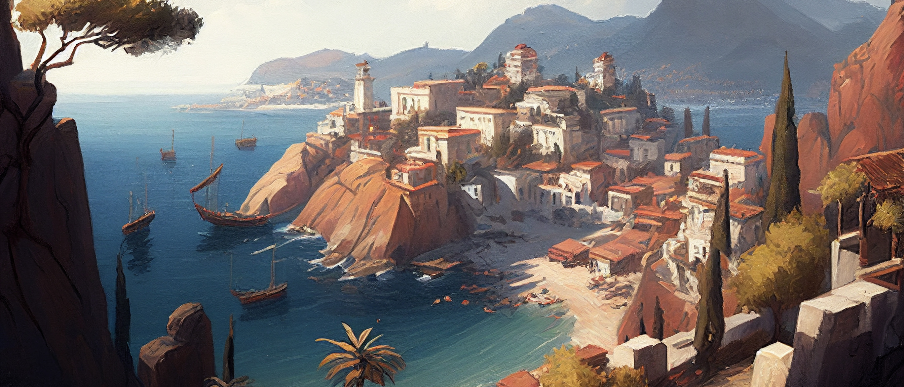
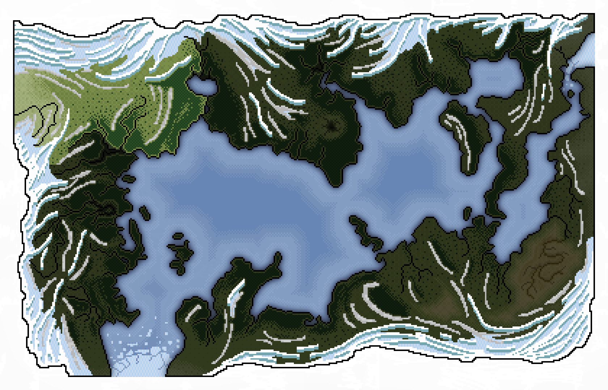
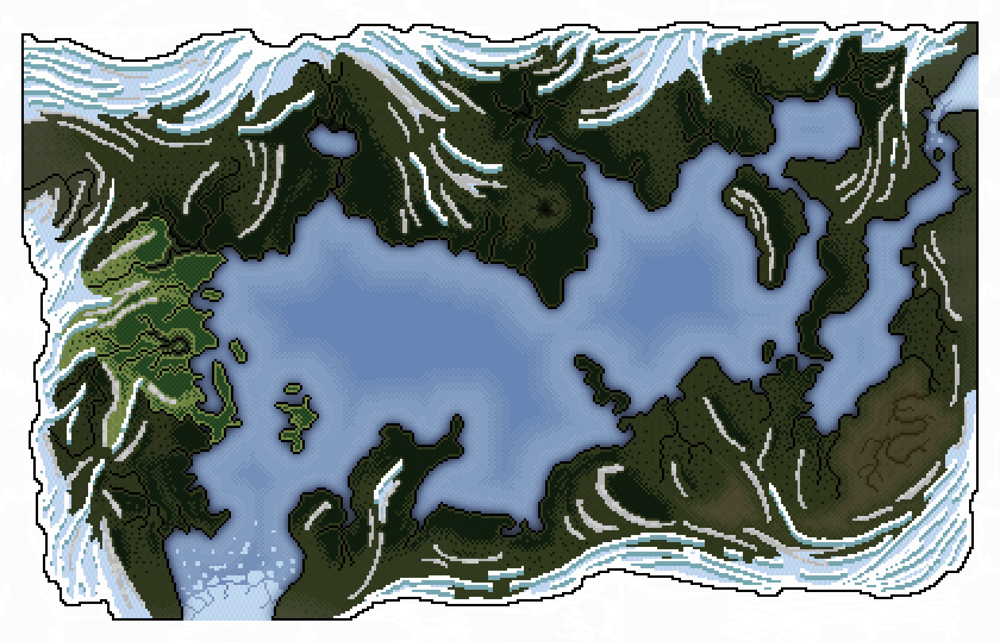
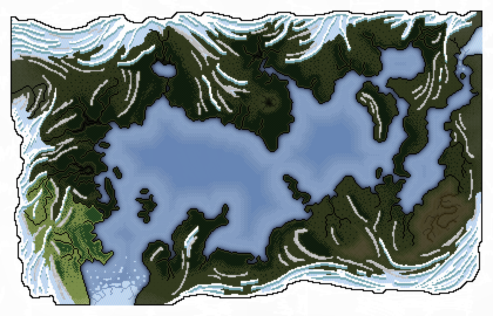

# The Western Shores
The [*Western Shores*](./glossary.md#western-shores) are rugged and diverse and home to a mix of human settlements and dwarven mining communities. Valuable ore from the mountains is mined and transported to the great polis, where skillfull craftmen turn it into weapons, tools, building materials or jewelry.

Despite their differences, the humans and dwarves of the [*Western Shores*](./glossary.md#western-shores) have learned to coexist and even collaborate, trading goods and services and sharing their knowledge and expertise. Together, they separated from the [*Kingdom of Epsylón*](./glossary.md#kingdom-of-epsylón), founding their own, independent [*Kingdom of Nabla*](./glossary.md#kingdom-of-nabla), an industrious society which leaves many scars in the mountains and forests of the [*Western Shores*](./glossary.md#western-shores).

The region is further split into three provinces [*Boréa*](#province-of-boréa), [*Malária*](#province-of-malária) and [*Théa*](#province-of-théa).

---

## Province of Boréa

[*Boréa*](./glossary.md#boréa) is the northern most province of the [*Western Shores*](./glossary.md#western-shores). Heropolis and the two dwarven citadels [*Oktogón*](./glossary.md#oktogón) and [*Gambrinos*](./glossary.md#gambrinos) can be found here, as well as the western half of the [*Dark Forest*](./glossary.md#dark-forest), the northern end of the [*Marshes of Malária*](./glossary.md#marshes-of-malária) and the [*Frostwind Steppe*](./glossary.md#frostwind-steppe).

> Read more about [**Heropolis**](./heropolis.md), [**Oktogón**](./dwarves.md#oktogón-citadel), [**Gambrinos**](./dwarves.md#gambrinos-citadel), [**Dark Forest**](./darkforest.md), [**Marshes of Malária**](./marshesofmalaria.md) and the [**Frostwind Steppe**](./frostwindsteppe.md).

---

## Province of Malária

[*Malária*](./glossary.md#malária) is the central province of the [*Western Shores*](./glossary.md#western-shores). The capitol of the [*Kingdom of Nabla*](./glossary.md#kingdom-of-nabla), [*Maxipolis*](./glossary.md#maxipolis), the towns of [*Brekéke*](./glossary.md#brekéke) and [*Phoíbi*](./glossary.md#phoíbi) and the majority of the infamous [*Marshes of Malária*](./glossary.md#marshes-of-malária) can be found here along with the name-giving and longest river in the [*Summer Sea*](./glossary.md#summer-sea), [*Malaria*](./glossary.md#malaria-river).

> Read more about [**Maxipolis**](./maxipolis.md), [**Brekéke**](./brekeke.md), [**Phoíbi**](./phoibi.md) and the [**Marshes of Malária**](./marshesofmalaria.md).

---

## Province of Théa

---

Go back [**Index**](./index.md) | [**Places**](./places.md)